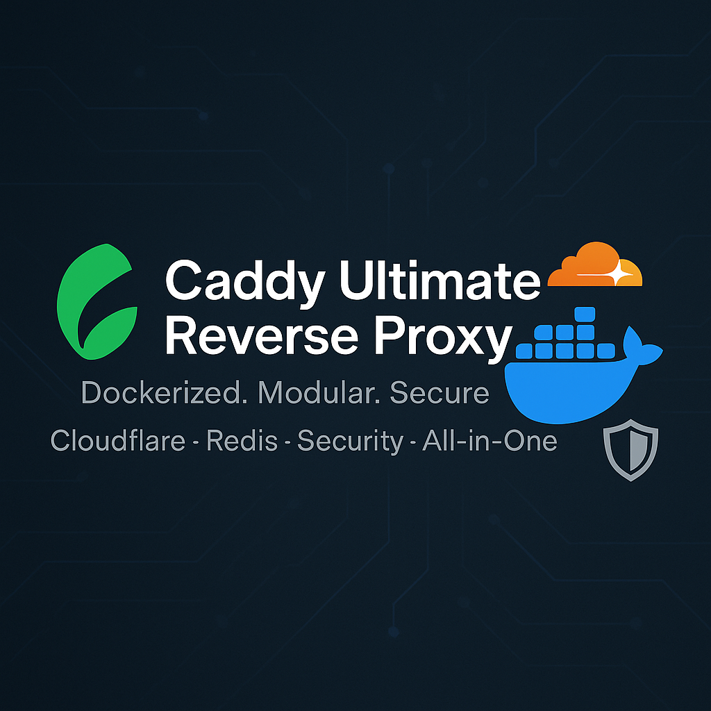

[](https://github.com/homeall/caddy-reverse-proxy-cloudflare/actions)

[](#) 
[](https://img.shields.io/docker/pulls/homeall/caddy-reverse-proxy-cloudflare)
[](https://hub.docker.com/r/homeall/caddy-reverse-proxy-cloudflare)
[](#) 
[](#) 
[](https://app.fossa.com/projects/git%2Bgithub.com%2Fhomeall%2Fcaddy-reverse-proxy-cloudflare?ref=badge_shield&issueType=license)
[](https://opensource.org/licenses/MIT)
[](https://ionut.vip)


# Caddy reverse proxy with cloudflare plugin

Enjoying the caffeine boost? If this repo saves you some time, [buy me a coffee](https://buymeacoffee.com/homeall)!
[](https://buymeacoffee.com/homeall)

<!-- TABLE OF CONTENTS -->
<details open="open">
  <summary>Table of Contents</summary>
  <ol>
    <li>
      <a href="#whats-new">What's New</a>
    </li>
    <li>
      <a href="#about-the-project">About The Project</a>
    </li>
    <li>
      <a href="#getting-started">Getting Started</a>
      <ul>
        <li><a href="#prerequisites">Prerequisites</a></li>
      </ul>
    </li>
    <li>
      <a href="#usage">Usage</a>
        <ul>
          <li><a href="#docker-compose">Docker-compose</a></li>
          <li><a href="#docker-run">Docker run</a></li>
        </ul>
        <ul>
        <li><a href="#testing">Testing</a></li>
      </ul>
    </li>
    <li><a href="#license">License</a></li>
      <li><a href="#contact">Contact</a></li>
      <li><a href="#support-this-project">Support</a></li>
  </ol>
</details>

## What's New

- Now built on a minimal **distroless** base image.
- Expanded plugin set including rate limiting, Cloudflare IP handling, geolocation, Coraza WAF, HTTP caching, and Brotli compression.
- Updated CI workflows and security docs.
- **Disabled caddy-docker-proxy/v2 plugin** - The Docker proxy functionality is currently disabled in this build.
- Added cache-handler and caddy-cbrotli plugins for enhanced performance.

<!-- ABOUT THE PROJECT -->
## About The Project

This docker image enhances the work from [@lucaslorentz](https://github.com/lucaslorentz/caddy-docker-proxy) by bundling several useful plugins:
* **[caddy-docker-proxy](https://github.com/lucaslorentz/caddy-docker-proxy)** – auto-configure Caddy from container labels (currently disabled in this build).
* **[caddy-dynamicdns](https://github.com/mholt/caddy-dynamicdns)** – updates DNS records when your IP changes.
* **[sablier](https://github.com/sablierapp/sablier)** – start workloads on demand and stop them when idle.
* **[CrowdSec bouncer](https://github.com/hslatman/caddy-crowdsec-bouncer)** – block malicious traffic via CrowdSec (HTTP/AppSec/Layer4).
* **[caddy-admin-ui](https://github.com/gsmlg-dev/caddy-admin-ui)** – experimental web UI for administration.
* **[caddy-storage-redis](https://github.com/pberkel/caddy-storage-redis)** – store certificates in Redis for clustered setups.
* **[Cloudflare DNS](https://github.com/caddy-dns/cloudflare)** – handle ACME DNS challenges through Cloudflare.
* **[transform-encoder](https://github.com/caddyserver/transform-encoder)** – additional compression encoders.
* **[caddy-ratelimit](https://github.com/mholt/caddy-ratelimit)** – simple request rate limiting.
* **[caddy-l4](https://github.com/mholt/caddy-l4)** – layer‑4 (TCP/UDP) features.
* **[caddy-cloudflare-ip](https://github.com/WeidiDeng/caddy-cloudflare-ip)** – log real client IPs when behind Cloudflare.
* **[caddy-maxmind-geolocation](https://github.com/porech/caddy-maxmind-geolocation)** – MaxMind GeoIP lookups.
* **[Coraza WAF](https://github.com/corazawaf/coraza-caddy)** – integrate the Coraza web application firewall.
* **[caddy-security](https://github.com/greenpau/caddy-security)** – authentication portals and security helpers.
* **[caddy-websockify](https://github.com/hadi77ir/caddy-websockify)** – proxy and translate WebSockets.
* **[cache-handler](https://github.com/caddyserver/cache-handler)** – HTTP caching middleware.
* **[caddy-cbrotli](https://github.com/dunglas/caddy-cbrotli)** – Brotli compression support with CGO.

The image uses a **distroless** base for a smaller footprint and improved security. Caddy and its plugins are refreshed automatically by GitHub Actions, so you always get the latest stable versions.

:notebook_with_decorative_cover: For detailed guidance on using the base caddy-docker-proxy functionality, refer to the [original documentation](https://github.com/lucaslorentz/caddy-docker-proxy).

This image is ideal for using :tm: [Caddy](https://caddyserver.com/) as a reverse proxy with [Let's Encrypt](https://letsencrypt.org/) and [Cloudflare DNS](https://www.cloudflare.com/dns/).

GitHub Actions automatically update the Docker image weekly, including Caddy and all plugins.

It also supports dynamic IP address updates via [Caddy DynamicDNS](https://github.com/mholt/caddy-dynamicdns).

:interrobang: Note: A **scoped API token** is required for Cloudflare DNS. Details can be found [here](https://github.com/libdns/cloudflare#authenticating).


<!-- GETTING STARTED -->
## Getting Started

:beginner: This image supports `linux/amd64`, `linux/arm`, and `linux/arm64` architectures, making it suitable for standard Linux servers and various ARM-based devices, including Raspberry Pi.

### Prerequisites

[](https://github.com/homeall/caddy-reverse-proxy-cloudflare/blob/main/Dockerfile)

You will need to have:

* :whale: [Docker](https://docs.docker.com/engine/install/)
* :whale2: [docker-compose](https://docs.docker.com/compose/) 
* Domain name -> you can get from [Name Cheap](https://www.namecheap.com)
* [Cloudflare DNS Zone](https://www.cloudflare.com/en-gb/learning/dns/glossary/dns-zone/)

<!-- USAGE -->
## Usage

### Docker Compose

:warning: Since caddy-docker-proxy is disabled, you must provide your own Caddyfile configuration. Labels are not processed. :arrow_down:

You will need to configure :tm: [Caddy](https://caddyserver.com/) directly through a Caddyfile, as the automatic Docker label processing is disabled.

:arrow_down: A simple [docker-compose.yml](https://docs.docker.com/compose/) with a custom Caddyfile:

```

services:
  caddy:
    container_name: caddy
    image: homeall/caddy-reverse-proxy-cloudflare:latest
    restart: unless-stopped
    environment:
      TZ: 'Europe/London'
    volumes:
      - "/var/run/docker.sock:/var/run/docker.sock"      # needs socket to read events
      - "./caddy-data:/data"                             # persist certificates via XDG_DATA_HOME
    ports:
      - "80:80"
      - "443:443"
      - "443:443/udp"                                    # Enable HTTP/3
      - "./Caddyfile:/etc/caddy/Caddyfile"               # Mount your custom Caddyfile

  whoami0:
    container_name: whoam
    image: traefik/whoami # Using traefik/whoami as jwilder/whoami is a bit old
    hostname: TheDocker #----->>Expected result using curl
    restart: unless-stopped
```
> Please get your scoped API-Token from  **[here](https://github.com/libdns/cloudflare#authenticating)**.

> You'll need to create a `Caddyfile` in the same directory as your docker-compose.yml with content like:
> ```caddyfile
> {
>     email email@example.com
>     acme_dns cloudflare $API_TOKEN
> }
>
> your.example.com {
>     reverse_proxy whoami0:80
> }
> ```

---

### Docker Run

For quick tests without a compose file:

```bash
docker run -d --name caddy \
  -v /var/run/docker.sock:/var/run/docker.sock \
  -v $(pwd)/caddy-data:/data \
  -e TZ="Europe/London" \
  -p 80:80 -p 443:443 -p 443:443/udp \
  homeall/caddy-reverse-proxy-cloudflare:latest
```

Note: Since caddy-docker-proxy is disabled, container labels are not processed. You must configure all routes in your Caddyfile.

---

### Using a Custom Caddyfile

**Note:** The `caddy-docker-proxy/v2` plugin is currently disabled in this build. You will need to provide your own Caddyfile for configuration.

By default, this image would use `caddy-docker-proxy` to generate Caddy's configuration from Docker labels, but since it's disabled, you must provide your own complete Caddyfile.

**How Caddy Loads Configuration:**
Caddy itself loads its primary configuration from `/etc/caddy/Caddyfile` by default.

**Important Notice:**
Since `caddy-docker-proxy/v2` is disabled in this build, the automatic generation of Caddy configuration from Docker labels is not available. You must provide your own Caddyfile configuration.

**Providing Your Own Caddyfile (Required Method):**
Since the label-based generation is disabled, you must mount your custom Caddyfile to `/etc/caddy/Caddyfile` for Caddy to use.

Example `docker-compose.yml` snippet:
```yaml
services:
  caddy:
    # ... other caddy service config ...
    image: homeall/caddy-reverse-proxy-cloudflare:latest
    volumes:
      - "/var/run/docker.sock:/var/run/docker.sock"  # Still needed if you import label-generated snippets or for other proxy features
      - "./caddy-data:/data"                         # persist certificates via XDG_DATA_HOME
      - "./my-custom-caddyfile:/etc/caddy/Caddyfile" # Mount your custom Caddyfile here
    # environment:
      # CADDY_DOCKER_CADDYFILE_PATH: '/etc/caddy/Caddyfile' # Default path for label-generated config.
                                                            # If you mount to /etc/caddy/Caddyfile, this var is implicitly handled.
    # ...
```
When you mount your own file to `/etc/caddy/Caddyfile`, Caddy will use it directly for its configuration. Since `caddy-docker-proxy` is disabled, this is the only way to configure Caddy in this build.

### Basic Caddyfile Example

Below is a minimal Caddyfile that configures a single domain using the Cloudflare DNS plugin. The Cloudflare API token is read from the `CLOUDFLARE_API_TOKEN` environment variable.

```caddyfile
{
    email you@example.com
    acme_dns cloudflare {env.CLOUDFLARE_API_TOKEN}
}

example.com {
    respond "Hello from Caddy"
}
```

Before running Caddy, ensure the `CLOUDFLARE_API_TOKEN` environment variable is set with a token that has permission to manage your domain's DNS records.

**Important Considerations:**
*   Since `caddy-docker-proxy` is disabled, you must provide a complete Caddyfile with all necessary configurations.
*   You are fully responsible for the content of your Caddyfile, including global options, TLS settings, and defining your sites.
*   Plugins like `caddy-storage-redis` require their configuration to be in the global options block of your Caddyfile.
*   All configurations that would normally be set via Docker labels must now be defined directly in your Caddyfile's global block `{...}`.

---

### :construction: Caddy Admin UI (Experimental)

The `caddy-admin-ui` plugin provides a web interface for managing Caddy.
To enable it, add the following configuration to your Caddyfile's global block:

```caddyfile
{
    admin 0.0.0.0:2019
    admin_origins your.admin.domain.com
    # admin_enforce_origin true
    # admin_instance_id "my-caddy-instance"
}
```

:warning: **Security Note**: Exposing the Caddy admin interface publicly can be a security risk. Ensure you understand the implications and secure it appropriately (e.g., using strong authentication, IP whitelisting, or running it on a private network). The plugin is also experimental.

---

###  Caddy Storage Redis

The `caddy-storage-redis` plugin allows Caddy to use Redis for storing certificates and other state. This is particularly useful in a distributed setup where multiple Caddy instances need to share this information.

Configuration for `caddy-storage-redis` is done within the global options of your Caddyfile (typically `/etc/caddy/Caddyfile`), specifically in the `storage` block. Environment variables are not directly used for configuring the Redis storage parameters themselves.

Here is an example Caddyfile snippet showing Redis storage configuration:

```caddyfile
{
    # All values are optional, below are the defaults
    storage redis {
        host           127.0.0.1
        port           6379
        address        127.0.0.1:6379 // derived from host and port values if not explicitly set
        username       ""
        password       ""
        db             0
        timeout        5
        key_prefix     "caddy"
        encryption_key ""    // default no encryption; enable by specifying a secret key containing 32 characters (longer keys will be truncated)
        compression    false // default no compression; if set to true, stored values are compressed using "compress/flate"
        tls_enabled    false
        tls_insecure   true
    }
}

:443 {
    # Your site configuration
    # e.g., reverse_proxy / your-app:port
}
```

:information_source: **Note:** The example above shows the default values for the Redis storage module. If your Redis instance is running on a different server or requires authentication, you will need to update the `host`, `port`, `address` (if not using default host/port), `username`, `password`, and `tls_enabled` fields accordingly.

You'll also need a Redis instance running and accessible by Caddy. Here's a simple example of adding a Redis service to your `docker-compose.yml` if you don't have one already:

```yaml
services:
  # ... your caddy service ...

  redis:
    image: redis:alpine
    container_name: redis
    restart: unless-stopped
    volumes:
      - "./redis-data:/data" # Persist Redis data
    # For production, set a password:
    # command: redis-server --requirepass your-strong-password
```
If you set a password for Redis, ensure you configure it in your Caddyfile's `storage redis` block.

To use a custom Caddyfile (e.g., for configuring Redis storage or other specific settings not covered by labels), mount it to `/etc/caddy/Caddyfile`. See the "Using a Custom Caddyfile" section above for more details.

Example `docker-compose.yml` for Caddy service using a custom Caddyfile for Redis storage:
```yaml
services:
  caddy:
    container_name: caddy
    image: homeall/caddy-reverse-proxy-cloudflare:latest
    restart: unless-stopped
    environment:
      TZ: 'Europe/London'
      # CADDY_DOCKER_CADDYFILE_PATH: '/etc/caddy/Caddyfile' # Default path for label-generated config.
                                                            # When mounting to /etc/caddy/Caddyfile, this is implicitly handled.
    volumes:
      - "./caddy-data:/data"                         # persist certificates via XDG_DATA_HOME
      - "./my-caddyfile-with-redis-config:/etc/caddy/Caddyfile" # Mount your Caddyfile here
    ports:
      - "80:80"
      - "443:443"
      - "443:443/udp"
    # Note: Docker labels are not processed since caddy-docker-proxy is disabled
    # All configuration must be done in your custom Caddyfile
```
The `caddy-storage-redis` configuration (like the `storage redis { ... }` block) must be in the global options of the Caddyfile that Caddy loads (i.e., `/etc/caddy/Caddyfile` if you've mounted your own).


:arrow_up: [Go on TOP](#about-the-project) :point_up:

### Testing

:arrow_down: Your can run the following command to see that is working:
 
```
$  curl --insecure -vvI https://your.example.com 2>&1 | awk 'BEGIN { cert=0 } /^\* Server certificate:/ { cert=1 } /^\*/ { if (cert) print }'
* Server certificate:
*  subject: CN=your.example.com 
*  start date: <Date specific to your test>
*  expire date: <Date specific to your test>
*  issuer: CN=Fake LE Intermediate X1 # This indicates staging/test certificate
*  SSL certificate verify result: unable to get local issuer certificate (20), continuing anyway.
* Using HTTP2, server supports multi-use
* Connection state changed (HTTP/2 confirmed)
* Copying HTTP/2 data in stream buffer to connection buffer after upgrade: len=0
* Using Stream ID: 1 (easy handle <some_hex_value>)
* TLSv1.3 (IN), TLS handshake, Newsession Ticket (4):
* Connection state changed (MAX_CONCURRENT_STREAMS == 250)!
$  curl -k https://your.example.com
I'm TheDocker
```
Make sure to replace `your.example.com` with the domain you configured in your Caddyfile. The output `I'm TheDocker` comes from the `hostname` set in the `whoami` service. If you used `traefik/whoami` on port 80, it will output its own identifying information.


## License

:newspaper_roll: Check the [LICENSE](https://raw.githubusercontent.com/homeall/caddy-reverse-proxy-cloudflare/main/LICENSE) for more information.

<!-- CONTACT -->
## Contact

:red_circle: [Open an issue on GitHub](https://github.com/homeall/caddy-reverse-proxy-cloudflare/issues/new/choose) if you run into problems.
## Support this project
If you find this image useful, you can [buy me a coffee](https://buymeacoffee.com/homeall) to help keep development going.

[](https://buymeacoffee.com/homeall)


