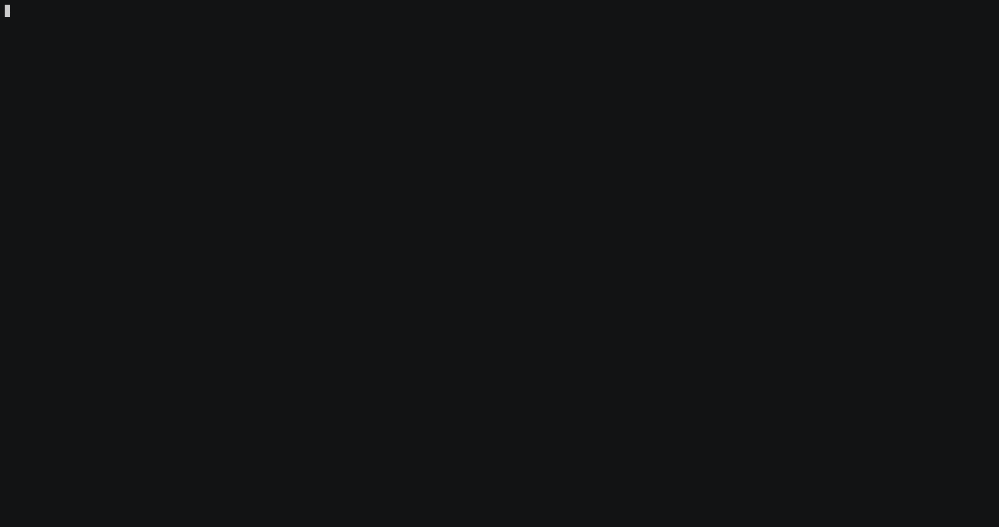

[](https://github.com/homeall/caddy-reverse-proxy-cloudflare/actions) [](https://img.shields.io/docker/pulls/homeall/caddy-reverse-proxy-cloudflare) [](https://img.shields.io/docker/image-size/homeall/caddy-reverse-proxy-cloudflare)
[](https://ionut.vip)


# Caddy reverse proxy with cloudflare plugin

<!-- TABLE OF CONTENTS -->
<details open="open">
  <summary>Table of Contents</summary>
  <ol>
    <li>
      <a href="#about-the-project">About The Project</a>
    </li>
    <li>
      <a href="#getting-started">Getting Started</a>
      <ul>
        <li><a href="#prerequisites">Prerequisites</a></li>
      </ul>
    </li>
    <li>
      <a href="#usage">Usage</a>
      <ul>
        <li><a href="#docker-compose">Docker-compose</a></li>
      </ul>
        <ul>
        <li><a href="#testing">Testing</a></li>
      </ul>
    </li>
    <li><a href="#license">License</a></li>
    <li><a href="#contact">Contact</a></li>
    <li><a href="#acknowledgements">Acknowledgements</a></li>
  </ol>
</details>

<!-- ABOUT THE PROJECT -->
## About The Project

This docker image is based on work from [@lucaslorentz](https://github.com/lucaslorentz/caddy-docker-proxy) which I included the [plugin Cloudflare](https://github.com/caddy-dns/cloudflare). 

This is only difference between this one and his image. 

:notebook_with_decorative_cover: If you need more details about how to use this image I will advise you to go to his GitHub and review the [documentation](https://github.com/lucaslorentz/caddy-docker-proxy).

It is useful if you are planning to use the reverse proxy from :tm: [Caddy](https://caddyserver.com/) together with [Let's Encrypt](https://letsencrypt.org/) and [Cloudflare DNS](https://www.cloudflare.com/dns/) as a challenge. 

The main purpose of creating this image is to have DNS challenge for **wildcard domains**. 

I am using GitHub Actions where it will update weekly docker image and both plugins.

It also can keep the IP address up to date thanks to [Caddy DynamicDNS](https://github.com/mholt/caddy-dynamicdns).

:interrobang: Note: you will need **the scoped API token** for this setup. Please analyze this **[link](https://github.com/libdns/cloudflare#authenticating)**.


<!-- GETTING STARTED -->
## Getting Started

:beginner: It will work on any Linux box amd64 or [Raspberry Pi](https://www.raspberrypi.org) with arm64 or arm32. 

### Prerequisites

[](https://github.com/homeall/caddy-reverse-proxy-cloudflare/blob/main/Dockerfile)

You will need to have:

* :whale: [Docker](https://docs.docker.com/engine/install/)
* :whale2: [docker-compose](https://docs.docker.com/compose/) 
* Domain name -> you can get from [Name Cheap](https://www.namecheap.com)
* [Cloudflare DNS Zone](https://www.cloudflare.com/en-gb/learning/dns/glossary/dns-zone/)

<!-- USAGE -->
## Usage

### Docker Compose

:warning: You will have to use **labels** in docker-compose deployment. Please review below what it means each [label](https://caddyserver.com/docs/caddyfile/directives/tls). :arrow_down:

You will tell :tm: [Caddy](https://caddyserver.com/) where it has to route traffic in docker network, as :tm: [Caddy](https://caddyserver.com/) is **ingress** on this case. 

:arrow_down: A simple [docker-compose.yml](https://docs.docker.com/compose/):

```
version: "3.3"

services:
  caddy:
    container_name: caddy
    image: homeall/caddy-reverse-proxy-cloudflare:latest
    restart: unless-stopped
    environment:
      TZ: 'Europe/London'
    volumes:
      - "/var/run/docker.sock:/var/run/docker.sock" #### needs socket to read events
      - "./caddy-data:/data" #### needs volume to back up certificates
    ports:
      - "80:80"
      - "443:443"
    labels: # Global options
      caddy.email: email@example.com #### needs for acme CERT registration account

  whoami0:
    container_name: whoiam
    image: jwilder/whoami:latest
    hostname: TheDocker ############################----->>Expected result using curl
    restart: unless-stopped
    labels:
      caddy: your.example.com #### needs for caddy to redirect traffic
      # caddy.servers.protocols: "experimental_http3" #### For HTTP/3
      # caddy.tls.ca: "https://acme.zerossl.com/v2/DV90" ### Only if you will prefer ZeroSSL. Default it is Let's Encypt.
      caddy.reverse_proxy: "{{upstreams 8000}}" #### needs to tell caddy which port number should send traffic
      caddy.tls.protocols: "tls1.3" #### This is optional. Default it is tls1.2
      caddy.tls.ca: "https://acme-staging-v02.api.letsencrypt.org/directory" # Needs only for testing purpose. Remove this line after you finished your tests.
      caddy.tls.dns: "cloudflare $API-TOKEN" #### You will have to replace here $API-TOKEN with your real scoped API token from Cloudflare.
```
> Please get your scoped API-Token from  **[here](https://github.com/libdns/cloudflare#authenticating)**.

:arrow_up: [Go on TOP](#about-the-project) :point_up:

### Testing

:arrow_down: Your can run the following command to see that is working:
 
```
$  curl --insecure -vvI https://test.ionut.vip 2>&1 | awk 'BEGIN { cert=0 } /^\* Server certificate:/ { cert=1 } /^\*/ { if (cert) print }'
* Server certificate:
*  subject: CN=test.ionut.vip ################################ CA from Let's Enctrypt Staging 
*  start date: Jan  5 15:15:00 2021 GMT
*  expire date: Apr  5 15:15:00 2021 GMT
*  issuer: CN=Fake LE Intermediate X1 ######################## This is telling you that acme is working as expected!
*  SSL certificate verify result: unable to get local issuer certificate (20), continuing anyway.
* Using HTTP2, server supports multi-use
* Connection state changed (HTTP/2 confirmed)
* Copying HTTP/2 data in stream buffer to connection buffer after upgrade: len=0
* Using Stream ID: 1 (easy handle 0x7fc02180ec00)
* TLSv1.3 (IN), TLS handshake, Newsession Ticket (4):
* Connection state changed (MAX_CONCURRENT_STREAMS == 250)!
$  curl -k https://test.ionut.vip
I'm TheDocker################################### Expected result from hostname above
```


:hearts: On the status column of the docker, you will notice the `healthy` word. This is telling you that docker is running [healtcheck](https://scoutapm.com/blog/how-to-use-docker-healthcheck) itself in order to make sure it is working properly. 

:arrow_down: Please test yourself using the following command:

```
❯ docker inspect --format "{{json .State.Health }}" caddy | jq
{
  "Status": "healthy",
  "FailingStreak": 0,
  "Log": [
    {
      "Start": "2021-01-04T11:10:49.2975799Z",
      "End": "2021-01-04T11:10:49.3836437Z",
      "ExitCode": 0,
      "Output": ""
    }
  ]
}
```

<!-- LICENSE -->
## License

:newspaper_roll: Distributed under the MIT license. See [LICENSE](https://raw.githubusercontent.com/homeall/caddy-reverse-proxy-cloudflare/main/LICENSE) for more information.

<!-- CONTACT -->
## Contact

:red_circle: Please free to open a ticket on Github.

<!-- ACKNOWLEDGEMENTS -->
## Acknowledgements

 * :tada: [@lucaslorentz](https://github.com/lucaslorentz/caddy-docker-proxy) :trophy:
 * :tada: :tm: [@Caddy](https://github.com/caddyserver/caddy) :1st_place_medal: and its huge :medal_military: **community** :heavy_exclamation_mark:
 * :tada: [dns.providers.cloudflare](https://github.com/caddy-dns/cloudflare) :medal_sports:

:arrow_up: [Go on TOP](#about-the-project) :point_up:
